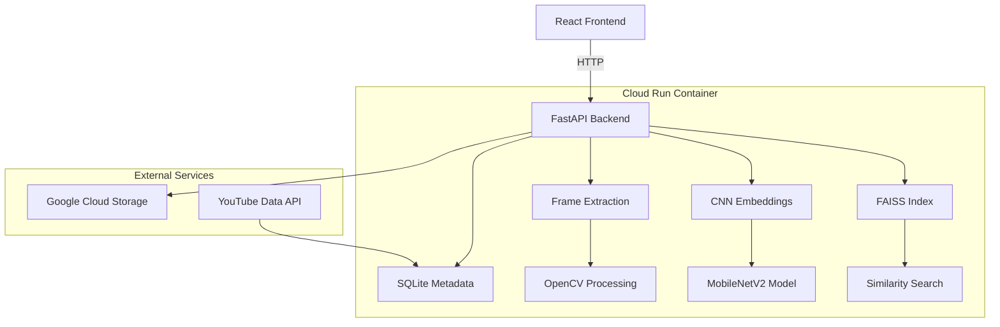
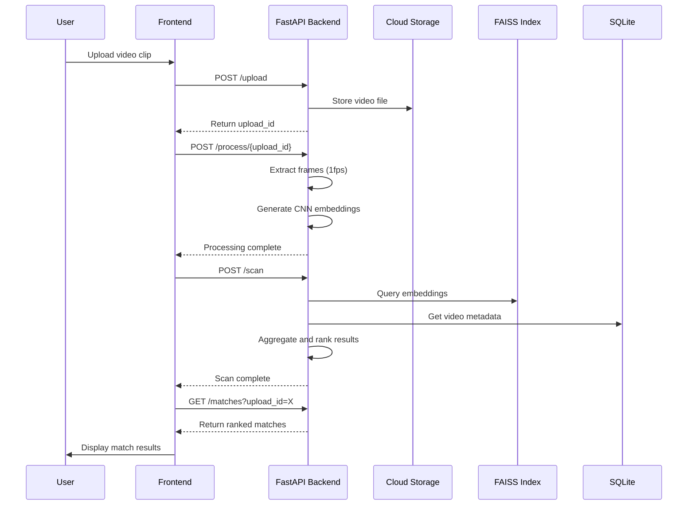
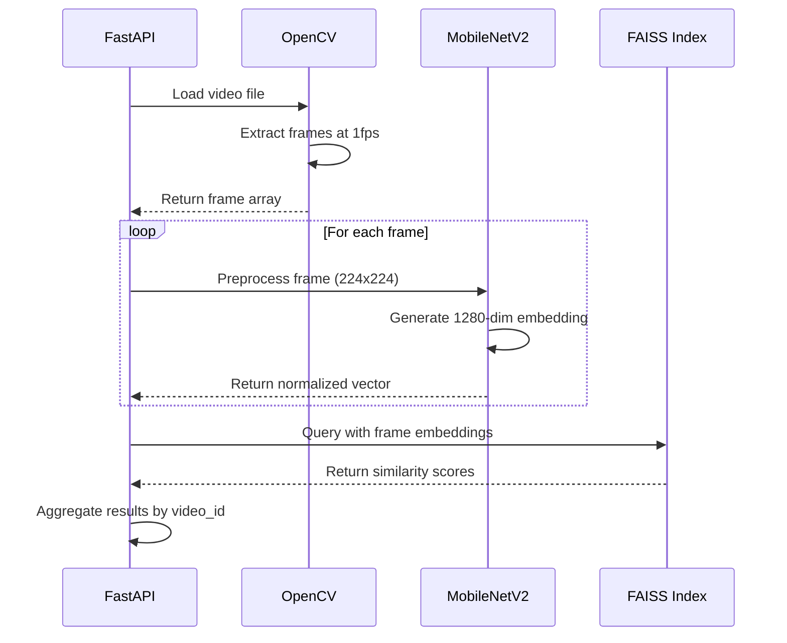

# Design Document: Digital Sports Media Asset Protection System

## Overview

The Digital Sports Media Asset Protection System is a 5-day prototype for the Google Solution Challenge that detects unauthorized use of sports media clips through visual fingerprinting. The system enables sports organizations to upload official clips and find visually similar videos in a pre-collected dataset, returning similarity scores and matched timestamps. It uses a single FastAPI service on Cloud Run with a React frontend, implementing a core pipeline of Upload → Extract Frames → CNN Embeddings → FAISS Query → Ranked Results using MobileNetV2 for frame embeddings and FAISS for similarity search.

## Architecture



## Sequence Diagrams

### Main Processing Flow



### Frame Processing Pipeline



## Components and Interfaces

### Component 1: FastAPI Backend

**Purpose**: Main application server handling all API endpoints, video processing, and similarity matching

**Interface**:
```pascal
INTERFACE FastAPIBackend
  uploadVideo(file: VideoFile): UploadResponse
  processVideo(uploadId: String): ProcessResponse
  scanForMatches(uploadId: String): ScanResponse
  getMatches(uploadId: String): MatchResults
  getHealth(): HealthStatus
END INTERFACE
```

**Responsibilities**:
- Handle video upload and storage to GCS
- Coordinate frame extraction and embedding generation
- Execute FAISS similarity queries
- Aggregate and rank match results
- Serve static frontend assets

### Component 2: Frame Extraction Service

**Purpose**: Extract frames from video files at 1fps using OpenCV

**Interface**:
```pascal
INTERFACE FrameExtractor
  extractFrames(videoPath: String): FrameArray
  getVideoMetadata(videoPath: String): VideoMetadata
END INTERFACE
```

**Responsibilities**:
- Load video files from GCS or local storage
- Extract frames at specified intervals (1fps)
- Return preprocessed frame arrays for embedding

### Component 3: CNN Embedding Service

**Purpose**: Generate visual embeddings using MobileNetV2 pretrained model

**Interface**:
```pascal
INTERFACE EmbeddingGenerator
  generateEmbedding(frame: ImageFrame): Vector1280
  preprocessFrame(frame: ImageFrame): NormalizedFrame
  batchGenerateEmbeddings(frames: FrameArray): EmbeddingArray
END INTERFACE
```

**Responsibilities**:
- Preprocess frames to 224x224 ImageNet format
- Generate 1280-dimensional embeddings using MobileNetV2
- L2-normalize embeddings for cosine similarity

### Component 4: FAISS Similarity Search

**Purpose**: Perform fast similarity search against indexed video embeddings

**Interface**:
```pascal
INTERFACE FAISSIndex
  loadIndex(indexPath: String): Boolean
  queryEmbeddings(embeddings: EmbeddingArray, k: Integer): SearchResults
  getIndexSize(): Integer
END INTERFACE
```

**Responsibilities**:
- Load pre-built FAISS index from disk
- Execute similarity queries with cosine similarity
- Return top-k matches with scores and indices

### Component 5: Match Aggregation Service

**Purpose**: Aggregate frame-level matches into video-level results with confidence scoring

**Interface**:
```pascal
INTERFACE MatchAggregator
  aggregateMatches(frameMatches: FrameMatchArray): VideoMatchArray
  calculateConfidence(matches: VideoMatch): ConfidenceScore
  rankResults(matches: VideoMatchArray): RankedResults
END INTERFACE
```

**Responsibilities**:
- Group frame matches by video_id
- Calculate confidence scores based on match count and similarity
- Rank results by confidence and similarity scores

## Data Models

### Model 1: VideoMetadata

```pascal
STRUCTURE VideoMetadata
  id: String
  title: String
  thumbnailUrl: String
  youtubeUrl: String
  durationSecs: Integer
  frameCount: Integer
  faissStartIdx: Integer
  faissEndIdx: Integer
END STRUCTURE
```

**Validation Rules**:
- id must be non-empty string
- durationSecs must be positive integer
- faissStartIdx must be less than faissEndIdx

### Model 2: FrameMatch

```pascal
STRUCTURE FrameMatch
  queryFrameIdx: Integer
  datasetVideoId: String
  datasetFrameIdx: Integer
  similarityScore: Float
  timestamp: Float
END STRUCTURE
```

**Validation Rules**:
- similarityScore must be between 0.0 and 1.0
- timestamp must be non-negative
- queryFrameIdx and datasetFrameIdx must be non-negative

### Model 3: VideoMatch

```pascal
STRUCTURE VideoMatch
  videoId: String
  title: String
  thumbnailUrl: String
  youtubeUrl: String
  similarityScore: Float
  confidence: String
  matchedFrames: Integer
  matchedSegment: TimeSegment
END STRUCTURE

STRUCTURE TimeSegment
  startSec: Float
  endSec: Float
END STRUCTURE
```

**Validation Rules**:
- similarityScore must be between 0.0 and 1.0
- confidence must be one of: "strong", "partial", "weak"
- matchedFrames must be positive integer
- startSec must be less than endSec

## Algorithmic Pseudocode

### Main Processing Algorithm

```pascal
ALGORITHM processVideoUpload(uploadId)
INPUT: uploadId of type String
OUTPUT: result of type ProcessResult

BEGIN
  ASSERT uploadId IS NOT NULL AND uploadId IS NOT EMPTY
  
  // Step 1: Load video from GCS
  videoPath ← getVideoPath(uploadId)
  ASSERT fileExists(videoPath)
  
  // Step 2: Extract frames with loop invariant
  frames ← EMPTY_ARRAY
  video ← openVideo(videoPath)
  fps ← getFrameRate(video)
  frameInterval ← ROUND(fps)  // 1 frame per second
  
  frameIndex ← 0
  WHILE hasMoreFrames(video) DO
    ASSERT allPreviousFramesValid(frames)
    
    frame ← readNextFrame(video)
    IF frameIndex MOD frameInterval = 0 THEN
      processedFrame ← preprocessFrame(frame)
      frames.ADD(processedFrame)
    END IF
    frameIndex ← frameIndex + 1
  END WHILE
  
  // Step 3: Generate embeddings for all frames
  embeddings ← EMPTY_ARRAY
  FOR each frame IN frames DO
    ASSERT isValidFrame(frame)
    
    embedding ← generateEmbedding(frame)
    normalizedEmbedding ← l2Normalize(embedding)
    embeddings.ADD(normalizedEmbedding)
  END FOR
  
  // Step 4: Store embeddings for scanning
  storeEmbeddings(uploadId, embeddings)
  
  result ← CREATE ProcessResult WITH
    uploadId: uploadId,
    frameCount: frames.LENGTH,
    status: "processed"
  
  ASSERT result.frameCount > 0
  RETURN result
END
```

**Preconditions**:
- uploadId corresponds to a valid uploaded video file
- Video file is accessible in GCS
- MobileNetV2 model is loaded and ready

**Postconditions**:
- All frames extracted at 1fps intervals
- All embeddings generated and normalized
- Processing result contains valid frame count
- Embeddings stored for subsequent scanning

**Loop Invariants**:
- All processed frames are valid and properly formatted
- All generated embeddings are 1280-dimensional and L2-normalized
- Frame extraction maintains temporal order

### Similarity Search Algorithm

```pascal
ALGORITHM scanForSimilarVideos(uploadId)
INPUT: uploadId of type String
OUTPUT: matches of type VideoMatchArray

BEGIN
  ASSERT uploadId IS NOT NULL
  
  // Step 1: Load query embeddings
  queryEmbeddings ← loadEmbeddings(uploadId)
  ASSERT queryEmbeddings.LENGTH > 0
  
  // Step 2: Query FAISS index for each frame
  frameMatches ← EMPTY_ARRAY
  FOR each embedding IN queryEmbeddings DO
    ASSERT isNormalized(embedding)
    
    results ← faissIndex.QUERY(embedding, K_NEIGHBORS)
    FOR each result IN results DO
      IF result.score >= MATCH_THRESHOLD THEN
        match ← CREATE FrameMatch WITH
          queryFrameIdx: embedding.index,
          datasetVideoId: getVideoIdFromFAISSIndex(result.index),
          datasetFrameIdx: getFrameIdFromFAISSIndex(result.index),
          similarityScore: result.score,
          timestamp: embedding.index * 1.0  // 1fps
        frameMatches.ADD(match)
      END IF
    END FOR
  END FOR
  
  // Step 3: Aggregate matches by video
  videoMatches ← aggregateByVideo(frameMatches)
  
  // Step 4: Calculate confidence and rank
  rankedMatches ← EMPTY_ARRAY
  FOR each videoMatch IN videoMatches DO
    confidence ← calculateConfidence(videoMatch, queryEmbeddings.LENGTH)
    videoMatch.confidence ← confidence
    rankedMatches.ADD(videoMatch)
  END FOR
  
  // Sort by confidence score descending
  SORT rankedMatches BY confidence DESC, similarityScore DESC
  
  ASSERT rankedMatches IS SORTED
  RETURN rankedMatches
END
```

**Preconditions**:
- uploadId has been processed and embeddings are available
- FAISS index is loaded and ready for queries
- Video metadata is available in SQLite database

**Postconditions**:
- All query embeddings have been searched against the index
- Frame matches are aggregated into video-level results
- Results are ranked by confidence and similarity scores
- Only matches above threshold are included

**Loop Invariants**:
- All processed embeddings are properly normalized
- Frame matches maintain correct video and timestamp associations
- Confidence calculations are consistent across all video matches

### Confidence Calculation Algorithm

```pascal
ALGORITHM calculateConfidence(videoMatch, totalQueryFrames)
INPUT: videoMatch of type VideoMatch, totalQueryFrames of type Integer
OUTPUT: confidence of type String

BEGIN
  ASSERT videoMatch IS NOT NULL
  ASSERT totalQueryFrames > 0
  
  matchRatio ← videoMatch.matchedFrames / totalQueryFrames
  avgSimilarity ← videoMatch.similarityScore
  
  confidenceScore ← matchRatio * avgSimilarity
  
  IF confidenceScore >= 0.6 THEN
    RETURN "strong"
  ELSE IF confidenceScore >= 0.3 THEN
    RETURN "partial"
  ELSE
    RETURN "weak"
  END IF
END
```

**Preconditions**:
- videoMatch contains valid matched frame count and similarity score
- totalQueryFrames is positive integer representing total frames in query video

**Postconditions**:
- Returns confidence level as string: "strong", "partial", or "weak"
- Confidence calculation is based on both match ratio and average similarity

## Key Functions with Formal Specifications

### Function 1: extractFrames()

```pascal
FUNCTION extractFrames(videoPath: String): FrameArray
```

**Preconditions:**
- `videoPath` is non-null and points to valid video file
- Video file is readable and contains valid video data
- OpenCV is properly initialized

**Postconditions:**
- Returns array of frames extracted at 1fps intervals
- All frames are preprocessed to 224x224 format
- Frame order matches temporal sequence in video
- No duplicate or corrupted frames in result

**Loop Invariants:**
- All previously extracted frames are valid and properly formatted
- Frame extraction maintains consistent time intervals

### Function 2: generateEmbedding()

```pascal
FUNCTION generateEmbedding(frame: ImageFrame): Vector1280
```

**Preconditions:**
- `frame` is valid 224x224 RGB image
- MobileNetV2 model is loaded and ready
- Frame is properly normalized with ImageNet statistics

**Postconditions:**
- Returns 1280-dimensional embedding vector
- Embedding is L2-normalized for cosine similarity
- Vector contains no NaN or infinite values
- Embedding captures visual features of input frame

### Function 3: queryFAISSIndex()

```pascal
FUNCTION queryFAISSIndex(embeddings: EmbeddingArray, k: Integer): SearchResults
```

**Preconditions:**
- `embeddings` array contains valid L2-normalized vectors
- `k` is positive integer less than index size
- FAISS index is loaded and ready for queries
- All embeddings are 1280-dimensional

**Postconditions:**
- Returns top-k most similar vectors from index
- Results include similarity scores and indices
- Scores are valid cosine similarity values (0.0 to 1.0)
- Results are sorted by similarity score descending

**Loop Invariants:**
- All query embeddings are processed in order
- Search results maintain correct index-to-video mappings

## Example Usage

```pascal
// Example 1: Complete video processing workflow
SEQUENCE
  uploadId ← "abc123"
  
  // Process uploaded video
  processResult ← processVideoUpload(uploadId)
  IF processResult.status = "processed" THEN
    DISPLAY "Extracted " + processResult.frameCount + " frames"
  END IF
  
  // Scan for similar videos
  matches ← scanForSimilarVideos(uploadId)
  IF matches.LENGTH > 0 THEN
    DISPLAY "Found " + matches.LENGTH + " potential matches"
    FOR each match IN matches DO
      DISPLAY match.title + " - " + match.confidence + " match"
    END FOR
  ELSE
    DISPLAY "No matches found"
  END IF
END SEQUENCE

// Example 2: Frame extraction and embedding
SEQUENCE
  videoPath ← "gs://bucket/uploads/video.mp4"
  frames ← extractFrames(videoPath)
  
  embeddings ← EMPTY_ARRAY
  FOR each frame IN frames DO
    embedding ← generateEmbedding(frame)
    embeddings.ADD(embedding)
  END FOR
  
  DISPLAY "Generated " + embeddings.LENGTH + " embeddings"
END SEQUENCE

// Example 3: FAISS similarity search
SEQUENCE
  queryEmbeddings ← loadEmbeddings("upload123")
  results ← queryFAISSIndex(queryEmbeddings, 10)
  
  FOR each result IN results DO
    IF result.score >= 0.8 THEN
      videoId ← getVideoIdFromIndex(result.index)
      DISPLAY "Strong match: " + videoId + " (score: " + result.score + ")"
    END IF
  END FOR
END SEQUENCE
```

## Correctness Properties

The system must satisfy these universal properties:

**Property 1: Frame Extraction Consistency**
```pascal
PROPERTY FrameExtractionConsistency
  FORALL video IN ValidVideos:
    frames ← extractFrames(video.path)
    IMPLIES frames.length = CEILING(video.durationSecs)
    AND FORALL i IN [0, frames.length-1]:
      frames[i].timestamp = i * 1.0
END PROPERTY
```

**Property 2: Embedding Normalization**
```pascal
PROPERTY EmbeddingNormalization
  FORALL frame IN ValidFrames:
    embedding ← generateEmbedding(frame)
    IMPLIES l2Norm(embedding) = 1.0
    AND embedding.dimension = 1280
END PROPERTY
```

**Property 3: Similarity Score Bounds**
```pascal
PROPERTY SimilarityScoreBounds
  FORALL query IN QueryEmbeddings, dataset IN DatasetEmbeddings:
    score ← cosineSimilarity(query, dataset)
    IMPLIES 0.0 <= score <= 1.0
END PROPERTY
```

**Property 4: Match Aggregation Correctness**
```pascal
PROPERTY MatchAggregationCorrectness
  FORALL frameMatches IN FrameMatchArrays:
    videoMatches ← aggregateByVideo(frameMatches)
    IMPLIES FORALL vm IN videoMatches:
      vm.matchedFrames = COUNT(fm IN frameMatches WHERE fm.videoId = vm.videoId)
      AND vm.similarityScore = AVERAGE(fm.score WHERE fm.videoId = vm.videoId)
END PROPERTY
```

**Property 5: Confidence Calculation Consistency**
```pascal
PROPERTY ConfidenceCalculationConsistency
  FORALL videoMatch IN VideoMatches, totalFrames IN PositiveIntegers:
    confidence ← calculateConfidence(videoMatch, totalFrames)
    confidenceScore ← (videoMatch.matchedFrames / totalFrames) * videoMatch.similarityScore
    IMPLIES (confidenceScore >= 0.6 AND confidence = "strong")
    OR (0.3 <= confidenceScore < 0.6 AND confidence = "partial")
    OR (confidenceScore < 0.3 AND confidence = "weak")
END PROPERTY
```

## Error Handling

### Error Scenario 1: Video Upload Failure

**Condition**: Network timeout or invalid file format during upload
**Response**: Return HTTP 400 with descriptive error message
**Recovery**: User can retry upload with valid file

### Error Scenario 2: Frame Extraction Failure

**Condition**: Corrupted video file or unsupported codec
**Response**: Log error details, return processing failure status
**Recovery**: System continues with other uploads, user notified of failure

### Error Scenario 3: FAISS Index Unavailable

**Condition**: Index file corrupted or not loaded properly
**Response**: Return HTTP 503 service unavailable
**Recovery**: Container restart loads fresh index, health check validates

### Error Scenario 4: Embedding Generation Failure

**Condition**: MobileNetV2 model fails to process frame
**Response**: Skip problematic frame, continue with remaining frames
**Recovery**: Process continues with available embeddings, log warning

### Error Scenario 5: GCS Storage Failure

**Condition**: Cloud Storage quota exceeded or network issues
**Response**: Return HTTP 507 insufficient storage
**Recovery**: Clean up old uploads, retry with exponential backoff

## Testing Strategy

### Unit Testing Approach

Test individual components in isolation with mock dependencies:
- Frame extraction with sample video files
- Embedding generation with known image inputs
- FAISS queries with synthetic embeddings
- Match aggregation with controlled frame match data
- Confidence calculation with various match scenarios

Target 90% code coverage for core processing functions.

### Property-Based Testing Approach

Use property-based testing to verify system invariants:

**Property Test Library**: fast-check (JavaScript/TypeScript)

**Key Properties to Test**:
- Embedding normalization: all generated embeddings have L2 norm = 1.0
- Similarity score bounds: all scores between 0.0 and 1.0
- Frame extraction consistency: frame count matches expected based on video duration
- Match aggregation correctness: video-level matches correctly aggregate frame-level matches
- Confidence calculation monotonicity: higher match ratios and similarities yield higher confidence

**Test Data Generation**:
- Generate random valid video metadata
- Create synthetic embedding vectors with controlled properties
- Generate frame match arrays with various distribution patterns

### Integration Testing Approach

Test complete workflows end-to-end:
- Upload → Process → Scan → Results pipeline
- Error handling across component boundaries
- GCS integration with actual file operations
- FAISS index loading and querying
- Database operations for metadata storage

Use test dataset with known ground truth matches to validate accuracy.

## Performance Considerations

**Frame Processing**: MobileNetV2 inference takes ~2-5 seconds per minute of video on CPU. For 60-second clips, expect ~5-10 seconds total processing time.

**Memory Usage**: Each 1280-dimensional embedding requires ~5KB storage. 60-second video (60 frames) needs ~300KB for embeddings.

**FAISS Query Performance**: Sub-second search across 15-20 videos (~1000-2000 total frames). Linear scaling with dataset size.

**Cold Start Optimization**: Bundle FAISS index in Docker image to avoid loading latency. Index size ~10-50MB for prototype dataset.

**Concurrent Processing**: Single-threaded processing sufficient for prototype. Consider async processing for production scale.

## Security Considerations

**Input Validation**: Validate video file formats, size limits (max 120 seconds), and MIME types to prevent malicious uploads.

**GCS Access Control**: Use service account with minimal required permissions (storage.objects.create, storage.objects.get).

**API Rate Limiting**: Implement per-IP rate limiting to prevent abuse of upload and processing endpoints.

**Data Privacy**: Uploaded videos stored temporarily in GCS, automatically cleaned up after processing.

**YouTube API Security**: Store API keys securely, respect quota limits, handle API errors gracefully.

## Dependencies

**Core Libraries**:
- FastAPI: Web framework for API endpoints
- OpenCV (cv2): Video processing and frame extraction
- PyTorch + torchvision: MobileNetV2 model and preprocessing
- FAISS: Similarity search and indexing
- SQLite: Metadata storage
- Google Cloud Storage: File storage

**External Services**:
- Google Cloud Run: Container hosting
- Google Cloud Storage: Video file storage
- YouTube Data API v3: Video metadata and thumbnails

**Development Tools**:
- Docker: Containerization
- React + TypeScript + Vite: Frontend framework
- yt-dlp: Dataset collection tool
- ffmpeg: Video variant generation